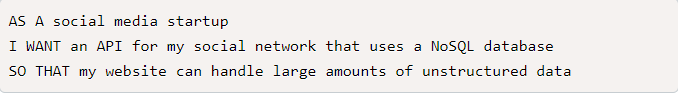
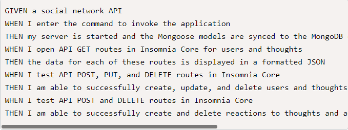
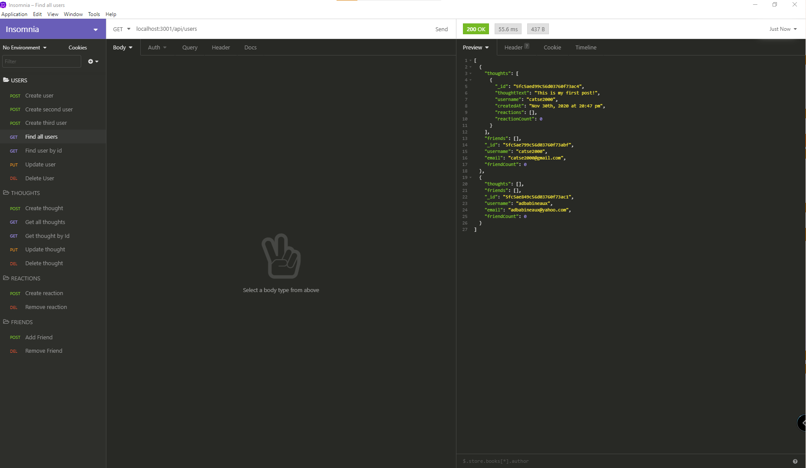

# social-app-api

## Description
This is the back-end api for a social media app. The application is able to create relationships between friends, users, thoughts, and reactions. 

## User Story

## Application Criteria

## Video Recording
[Video Recording of Application](https://drive.google.com/file/d/1SvtNbybyZoKJ8yNI_e2USGflbFKnqyq-/view)

## Github
[Github Repo](https://github.com/catse2000/social-app-api)

## Screenshot

